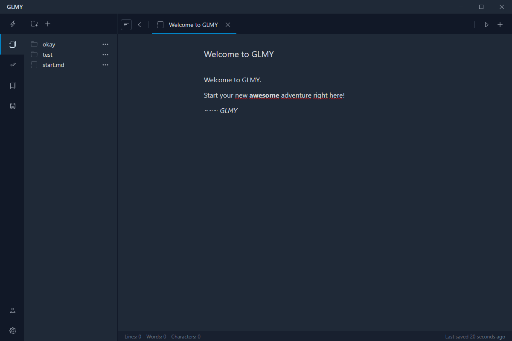

GLMY - Tauri Project
====================

> This project is under construction and in a very early development stage and thus not functional at the moment!

Features
--------
The following features are planned

- Write and Manage Notes (similar to Typora or Obsidian)
- Create and Manage Todos and Checklists
- Store and Tag Bookmarks
- Create and Play with databases (CSV, JSON, SQLite) incl. conversions

Awesome Dependencies
--------------------

- [TAURI](https://tauri.app/)
- [@milkdown](https://milkdown.dev/), based on [ProseMirror](https://prosemirror.net/)
- any many more... (see package.json)

Copyright & License
-------------------
Written by SamBrishes <sam@rat.md> - rat.md.

Published under the MIT license